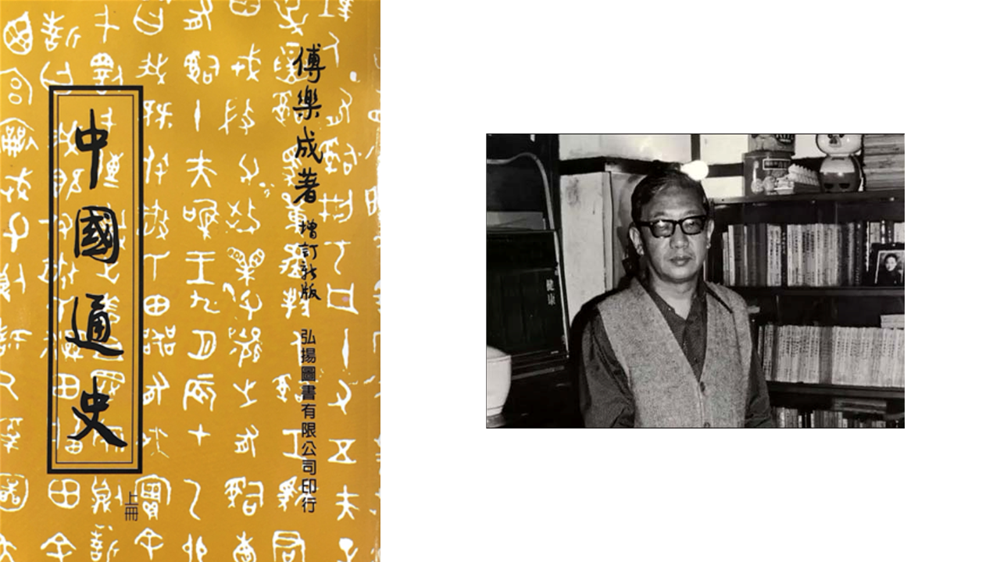
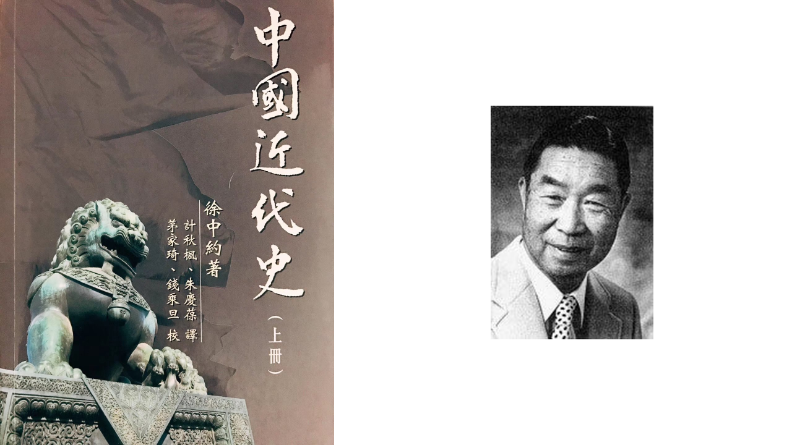
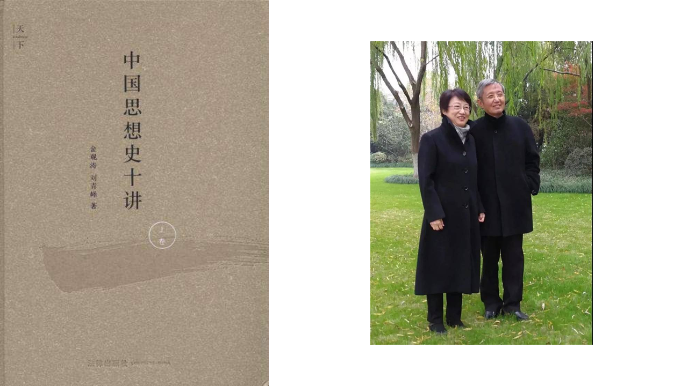
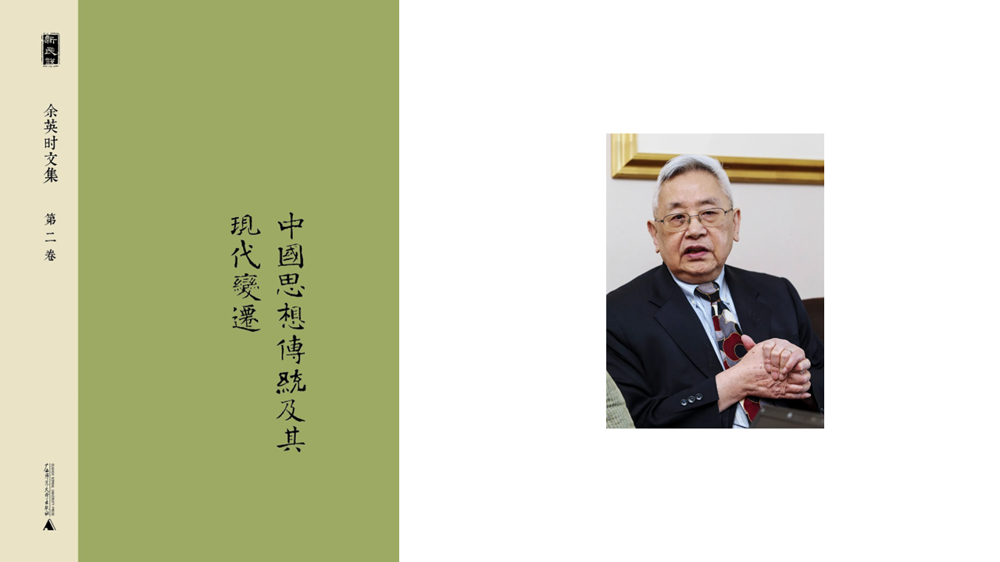
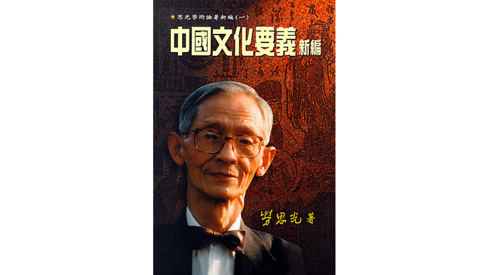
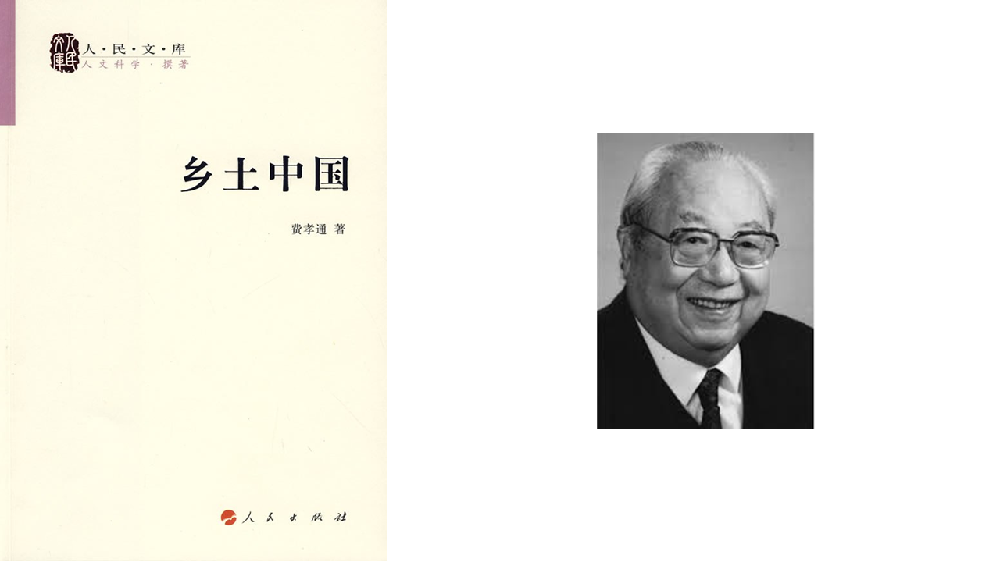
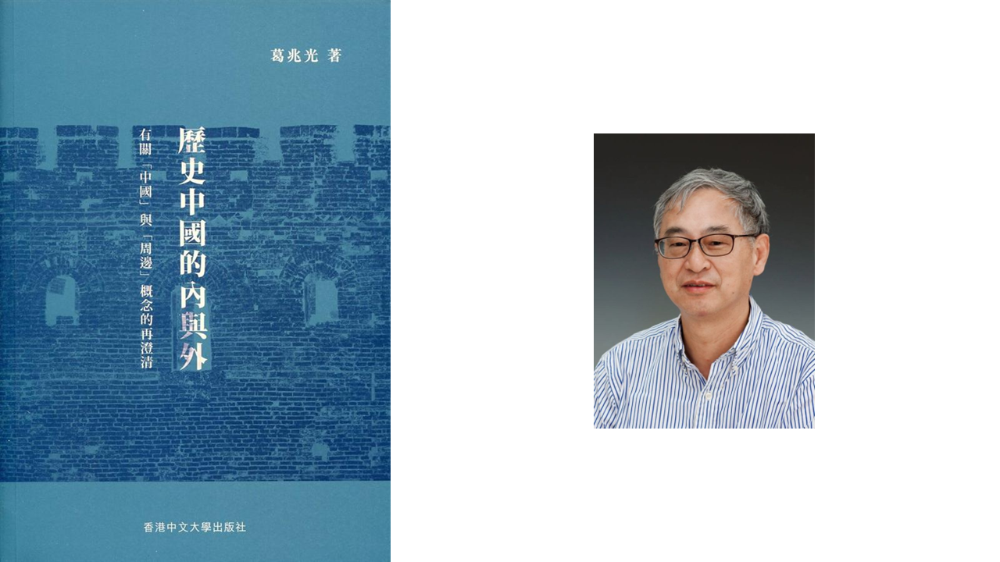

## 理解中国：自省（一）

中国文明，是世界上最古老的文明之一，也是世界上持续时间最长的文明之一。泱泱华夏，一片热土。作为生于斯、长于斯的中国人，我们需要更好地理解中国，尤其是它的历史，才能避免悲剧的重演。本期荐书将以「理解中国」为核心，分为「自省」（中国人的著作）和「镜像」（外国人的著作）两部分来推荐一些有助于读者深入理解中国的书籍。

### 傅乐成《中国通史》

傅乐成（1922—1984）， 史学大家傅斯年之侄，台湾著名史学家，台湾大学历史系教授，哈佛大学博士。

傅乐成所著《中国通史》，上探旧石器时代，下至1912年清帝退位，凡六十余万言。文字浅近平易，不做繁征博引，叙说清晰，见解持正，数千年中国史事之此伏彼起，重要节点，前因后果，俱在目前。意在使读者对中国历史有一较为清晰而客观的概念。全书重心有四：政治社会的变迁；对外关系；各种制度的演进；学术思想的渊流。所据资料有三：历朝旧史；近代学人的研究成果；作者的读史心得。对所据资料的整理及叙述，力求忠实谨慎，缺乏实证的见解和过分主观的议论，均不予采用。

### 徐中约《中国近代史》

徐中约（1923—2005），祖籍浙江宁波，出生于上海，美籍华人，历史学家，哈佛大学哲学博士，美国加州大学圣巴巴拉分校历史系荣休教授，中国近代史研究的权威学者。著作严谨，专长中国近代外交史。所著The Rise of Modern China一书自1970年面世后，先后修订六次，销售数十万册，为美国大学中国研究的权威著作。南京大学历史系茅家琦、钱乘旦、计秋枫、朱庆葆四位教授及中文大学郑会欣博士根据The Rise of Modern China（第六版）译出《中国近代史》，由香港中文大学出版社分上下两册出版。

本书内容以清朝立国起，以迄二十一世纪，缕述中国近四百年历史之演变。上册包括清帝国从建立、兴盛，以至衰亡；西方宗教、帝国主义及商业活动冲击中国；鸦片战争、八国联军及列强瓜分中国；维新变法、立宪运动、辛亥革命及新文化运动。下册包括中国共产党成立、国共分列及内战、抗日战争；中华人民共和国成立、文化大革命、中美关系及四人帮事件；中国八十年代改革、四个现代化、八九天安门事件、香港回归及中国迈向二十一世纪。本书不囿于任何一家学说、一种主义，开出一种折衷调和的史观，能够公平公正、客观冷静的看历史事件的发生；并且参考大量西方及日本学者的研究和档案资料，内容充实，极具参考价值。其中每章章末皆附有该章最新的重点参考书籍文献，对教研进修，大为珍贵。因此，本书适合本地高中及大学中国历史科的同学作为参考用书。

### 金观涛《中国思想史十讲（上卷）》

金观涛（1947—），生于浙江义乌，其父亲为著名化学家、原杭州大学化学系系主任金松寿。与其妻刘青峰二人在文革中期由北京大学毕业后，曾在郑州大学任教；1978年到中国科学院《自然辩证法通讯》杂志社任编辑工作，同时从事科学哲学和科学史研究；1980年代创办《走向未来》丛书，从事民间文化事业；1989年起在香港中文大学中国文化研究所工作。2008年退休后到台湾政治大学任教。

《中国思想史十讲》是金观涛、刘青峰两位作者自《观念史研究》后，在国内出版的第二部全新作品。本书根据二位作者主讲的中国思想史讲座讲义整理修改而成，分为上下两卷，上卷包括前六讲的内容，由先秦诸子到清代思想，下卷包括从晚清到当今中国思想大脉络的展开，上下两卷试图展现出一张从春秋战国到当今思潮的思想演化的整体图画。出于一些原因，本书下卷处于草稿状态，仍未面世，现仅有上卷出版。

书中，作者以其独有的大历史观，把思想史的演化与社会的历史变迁结合起来考察，并着重讲解了思想与社会的生动互动，给人一种思想触手可及、历史通透可察的感觉。该书是当代关于中国思想史的一部厚重专著，适于对中国文化感兴趣的读者、更适于关心人类文明和中国往何处去的读者认真阅读。

### 余英时《中国思想传统及其现代变迁》

余英时（1930—2021），安徽潜山人，生于天津。1950年至1955年就读于香港新亚书院及新亚研究所，师从钱穆先生。1956年至1961年就读于哈佛大学，师从杨联陞先生，获博士学位。曾任密歇根大学、哈佛大学、耶鲁大学教授，香港新书院院长兼中文大学副校长，普林斯顿大学讲座教授。

本卷以「中国思想传统及其现代变迁」为主题，所收文章论及儒家思想、新儒学及其与佛道之关系以及反智论等中国思想传统中的重大课题以及这些中国传统价值系统与现代的「遭遇」。这些文章既有对中国思想传统的整体观察与把握，又有对具体时代和问题的个案研究，层次分明，论证翔实严密。展现了余先生对中国近现代以来传统思想所经历的种种冲击和变革的观察与深思，针对性地疏理了中国思想传统的核心内容与历史脉络，提出并探讨了现代儒学所遇到种种困境及其所肩负的历史使命。具有深刻的洞见和关怀。

本卷每篇文章都具有很高的学术价值和学术水准，对中国思想史的相关核心问题有深入的思考，既有整体的观察，又有断面的分析，宏观与微观相结合，独立成章而又紧密联系。关注中国思想传统及其现代变迁，把思想传统放到文化历史脉络中，重新审视思想传统的内容和价值。对中国思想传及价值观在近现代所遭遇的困境，积极探索传统的现代诠释，同时对西方诠释系统保持了谨慎，极富现实意义。剖析了中国传统价值系统与现代的“遭遇”的方方面面。

### 劳思光《中国文化要义新编》

劳思光（1927—2012），原名劳荣玮，字仲琼，号韦斋，笔名思光，湖南长沙人，中国哲学家及教育家、中央研究院院士。学贯中西，尤其长于中国哲学史及现当代西方哲学。

《中国文化要义新编》为《思光学术论著新编》之第一种，以析论中国文化为课题。劳教授论述各种影响中国文化活动的价值观念，从而展示中国文化精神的特性；并透过对此文化精神的掌握，来说明中国历史中出现的生活态度、制度、习俗等现象的文化意义。劳教授于描述、整理的工作之外，还提出对中国文化精神的成就及缺陷的评估，同时对现代中国文化的困境和未来发展的方向等问题作出讨论。

### 费孝通《乡土中国》

费孝通（1910—2005），字彝江，江苏吴江人，中国社会学家、人类学家、民族学家、社会活动家，中国社会学和人类学的奠基人之一，第六届中国人民政治协商会议全国委员会副主席，第七、八届全国人民代表大会常务委员会副委员长。

《乡土中国》是费孝通著述的一部研究中国基层传统社会农村的作品，共由14篇文章组成。最初在1947年7月，「杂话乡土社会」系列文章在《世纪评论》上连载。1948年4月，系列文章作为「观察丛书」的一种结集出版。在此书中，作者用通俗，简洁的语言对中国的基层社会的主要特征进行了理论上的概述和分析，较为全面的展现了中国基层社会的面貌。

### 葛兆光《历史中国的内与外》

葛兆光（1950—），复旦大学文史研究院及历史系特聘教授。曾任日本京都大学、东京大学、比利时鲁汶大学、台湾大学、美国普林斯顿大学、哈佛燕京学社、芝加哥大学客座教授或访问学者。主要研究领域是东亚及中国的思想、文化与宗教史。

葛兆光教授十年前开始推动「从周边看中国」研究计划，把日本、韩国、越南等地保存的有关中国史资料作为「新材料」，试图提供重新认识东亚和中国的多重视角与立场。为此，葛教授陆续出版了《宅兹中国：重建有关「中国」的历史论述》、《何为中国？——疆域、民族、文化与历史》等著作，在国际学界受到广泛关注。本书是葛兆光教授有关东亚与中国研究系列论著之一。为了对「周边」及其相对应的「中国」概念做一个清晰的界定，作者在这本书中梳理历史上中国疆域、族群和文化的移动与交错，说明「内」与「外」之变化，并尝试沟通原本分属中外关系史、中国民族史（包括「边疆民族」）、历史地理学（包括「边疆史地」）、全球史（和区域史）等各学术领域的资料和方法。

