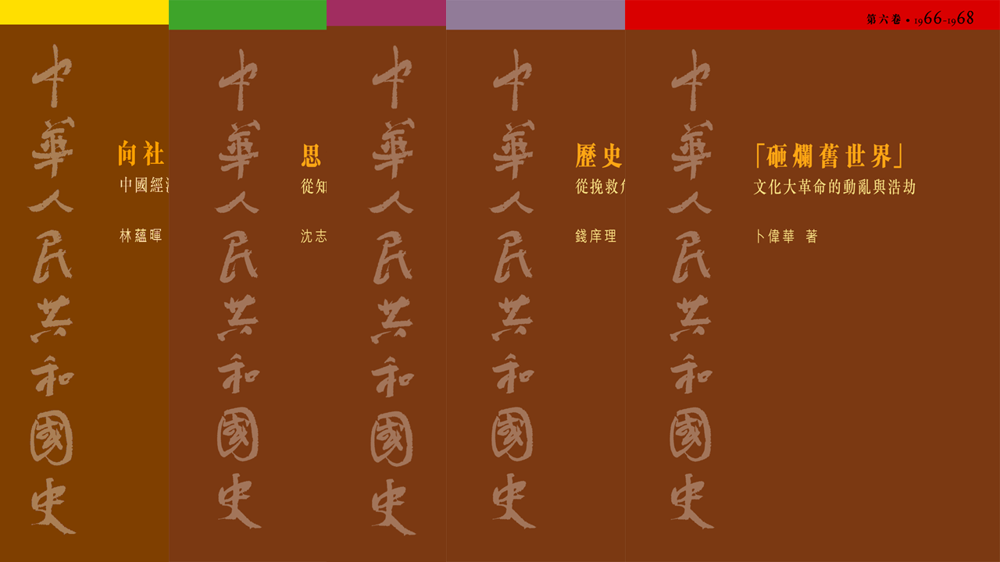
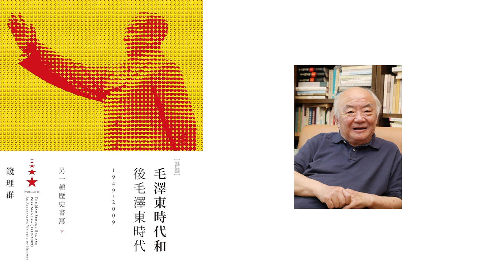
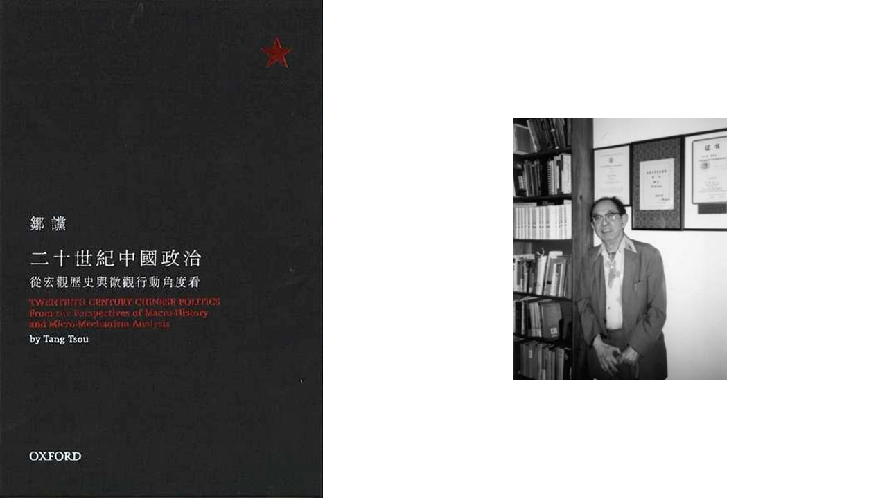
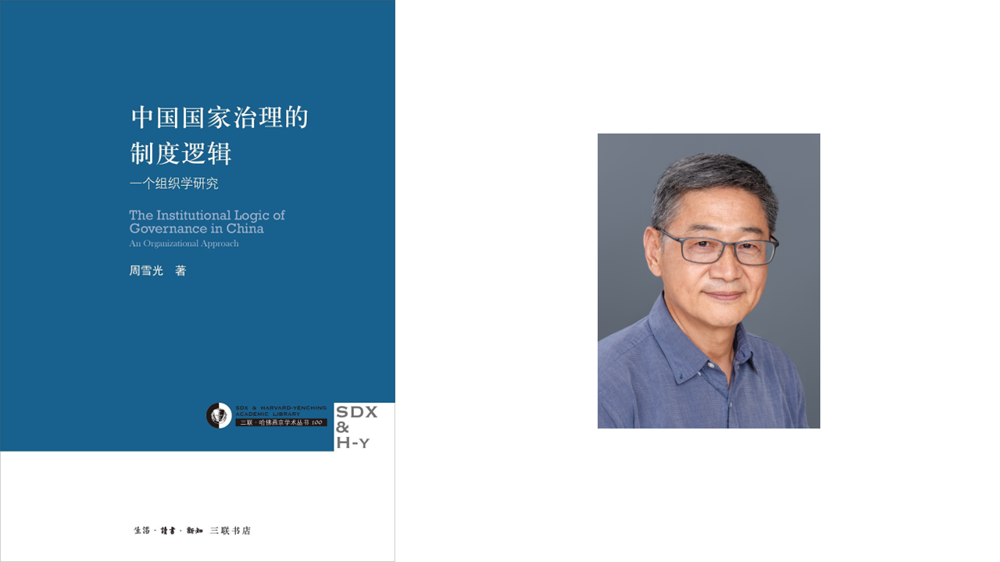
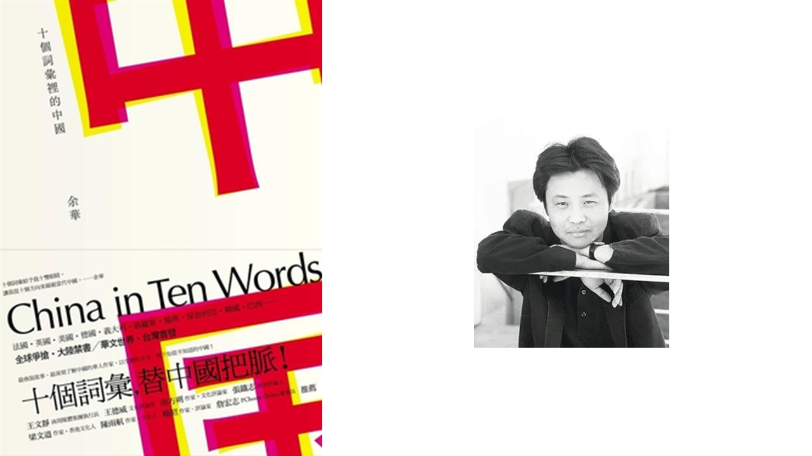
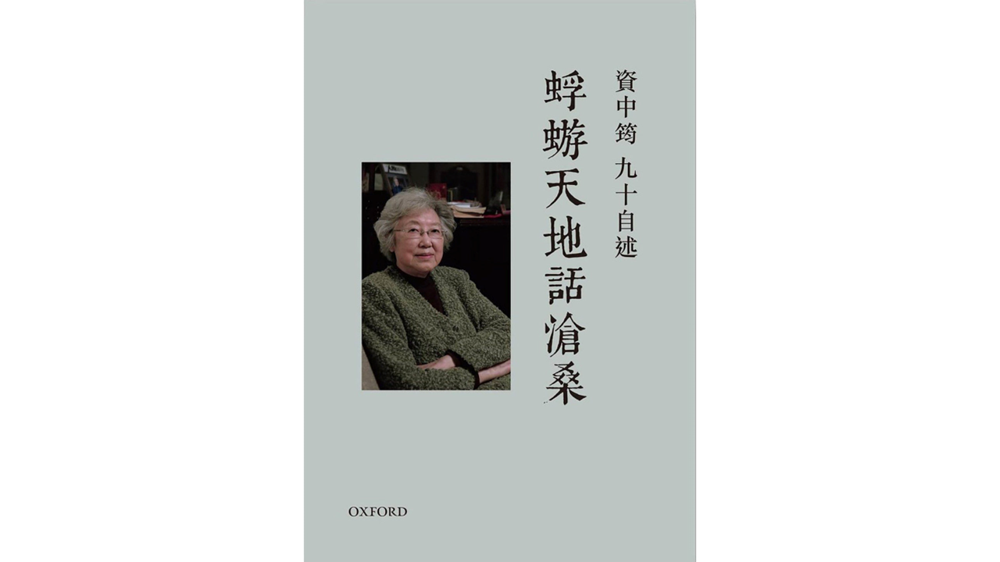
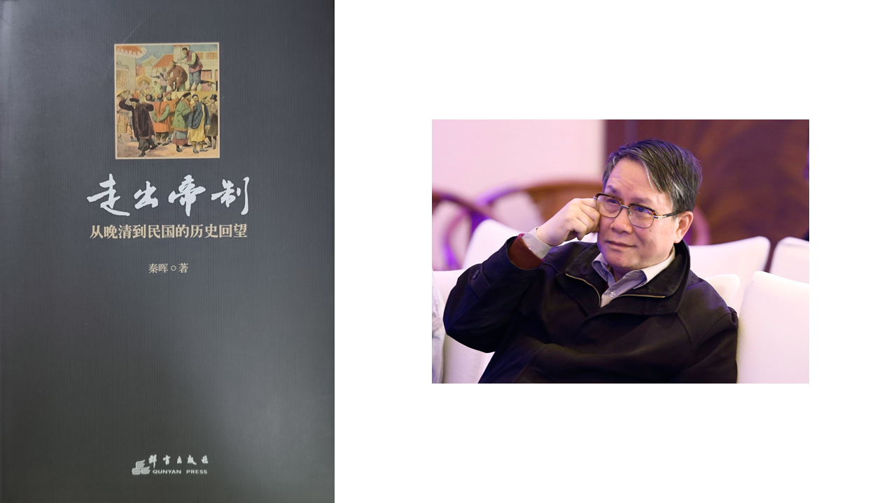

## 十卷本《中华人民共和国史》（1949—1981）

首先要说明的是，本套书的第一、七、九卷由于各种原因未能出版。负责撰写第七卷的高华教授罹患肝癌，已于2011年离世。读者若有兴趣，可参阅高华的《历史笔记》，第七卷的大纲收录其中。

这是一套由香港中文大学当代中国文化研究中心出版，香港中文大学出版社发行的资料翔实、忠于史实、摒除党派观点的中国当代史。每卷约六十万字、八百页，完整反映出中华人民共和国1949年至1981年间政治、经济、社会、文化各方面的发展全貌。

余英时评价：「这是到现在为止，一部规模最宏大、叙事最详尽的《中华人民共和国史》。……每卷都达到了史学著作的世界水平。作者不但一律以中俄档案、回忆录、口述历史等为基本原料，而且也大量地参考了中外学者的研究成果。不但如此，每位作者都以批判的态度检查史料，对于史料中互相冲突记载，详加考订，以建立最可信的史实。」

杨奎松、林蕴晖、辛石、沈志华、钱庠理、卜伟华、高华、史云、李丹慧、韩钢、萧冬连十一位功力深厚的中国当代史家合力撰写。各卷作者均是长期从事中共党史和国史研究专家，多次研讨，分工撰写，历时七年。

全景式历史纪录，通史与专题结合。既有反映高层决策和斗争的重大事件揭示，又有表现芸芸众生的喜怒哀乐、社会风貌和流行思潮的生动画面；各卷独立成篇，又首尾相贯。

倚重档案、考订详尽、辨析充分、观点开放。以中央及地方档案史料的发掘和最新研究成果为基础，对关系到中华人民共和国发展的重大史实作出详尽考订和分析。

《中华人民共和国史》是目前最具规模、足以了解当代中国政治发展及未来走向的大型中国当代史研究著述，是中外各图书馆、大学、研究机构，以及学者和教师的必备参考用书。

~~第一卷 断裂与延续──中华人民共和国的建立（1949-1952）~~
第二卷 向社会主义过渡──中国经济与社会的转型（1953-1955）
第三卷 思考与选择──从知识分子会议到反右派运动（1956-1957）
第四卷 乌托邦运动──从大跃进到大饥荒（1958-1961）
第五卷 历史的变局──从挽救危机到反修防修（1962-1965）
第六卷 「砸烂旧世界」──文化大革命的动乱与浩劫（1966-1968）
~~第七卷 新秩序和新冲突──从中共九大到林彪事件（1969-1971）~~
第八卷 难以继续的「继续革命」──从批林到批邓（1972-1976）
~~第九卷 革命的终结──从「阶级斗争为纲」到「经济建设为中心」1976-1978）~~
第十卷 历史的转轨──从拨乱反正到改革开放（1979-1981）

## 钱理群《毛泽东时代与后毛泽东时代：另一种历史书写》

钱理群（1939—），中国现代文学研究者、作家，研究生文化，无党派。二十世纪八十年代以来最具有代表性的人文学者之一。2002年以教授的正高级职称从北京大学退休，有以鲁迅和周作人为中心研究对象的专书著作和散文随笔多部。

钱理群以独立知识分子的立场，通过本书，对于自己如何走过毛泽东影响下之共和国六十年，做出回顾与反思。共和国六十年的政权迭替，整个国家民族经历了分裂动荡，在钱理群平静而从容的叙述调子底下，内蕴著历史的激情与苍凉。

「一方面，我是毛泽东时代所塑造的，毛泽东文化已渗透到我的血肉及灵魂中，这种毛泽东时代的印记永远改变不了，无论如何挣扎、自省、批判，我都是个无可救药的理想主义者、浪漫主义者、乌托邦主义者。另方面，我更是个毛泽东时代自觉的反叛者。我的历史使命就是反戈一击，对毛泽东做出同时代人所能达到的最彻底的清理和批判。既受他的影响，同时又是他的反叛者，并力图使自己成为彻底的反叛者。」──钱理群

作为亲历共和国六十年的独立知识分子，钱理群以其丰厚的历史经验与直面现实的批判力度，为读者打开一扇深入了解1949年至今的中国社会主义发展史、民间思想知识状况与毛泽东思想实践的窗口。钱理群以「毛泽东时代」与「后毛泽东时代」作为本书的叙述框架，指出毛泽东时代的1957年所底定之中国政治、经济、社会体制与后毛泽东时代有着内在的贯串性联系，这是批判性理解当下政体的核心关键。同时，钱理群致力挖掘中国当代民间思想，力图在被镇压、被抹杀的「民间异端」历史中，重拾那顽强存在的民间思想，并绘制其知识系谱，以提出一条中国民间版的社会主义思想道路。钱理群以其丰富的史料文本与作为一个历史见证者、参与者的亲历经建，精彩地勾勒出中国战后思想状况的景貌，并站在民间的立场、从一个独立知识分子的角度，为读者渐次打开、进入中国大陆战后历史与知识分子的内心世界，达到心的交流。

更重要的是，钱理群考察了自1950年代即出现的校园「右派」（校园民主运动）、文革间的民间思考、1980年的民运以及1989年的天安门民主运动，并认为它们之间有一脉「社会民主主义」的知识思想连续，亦与1990年代「新左派」与「自由主义」之争的知识分子论争以及当下中国的民间社会运动，有著复杂的内连性质，而这些知识运动与党内思想的分派彼此扯动，形成上下相互吸收、影响的关系。

钱理群将当前中国的思想、知识光谱做了历史化的考察，并以此回应、分析所谓「毛泽东的幽灵」在「后毛泽东时代」浮现的现象，对于当前「中国崛起热潮」以及与之相应的知识征候，提出即时、有力的批判与警醒。

## 邹谠《二十世纪中国政治：从宏观历史与微观行动的角度看》

关于二十世纪的中国政治，论者众多。邹谠教授从「宏观历史与微观行动的角度看」，可以说是看得最远、看得最透彻的一人。《二十世纪中国政治：从宏观历史与微观行动的角度看》是邹谠生前自己编成的唯一一部中文学术著作。

提起邹谠，不少人一知半解。邹谠正是连战在芝加哥大学读政治学博士的导师。邹老执教芝大逾半个世纪。他在1999年以80高龄去世时，芝加哥大学下半旗致哀，足见其在北美中国研究学界的地位。

邹谠又是北京大学名誉教授。《二十世纪中国政治》是作者在不同时期的论文、记者谈访录、演讲稿编在一起的文集，所探讨的问题也不尽相同，但无一不围绕作者毕生冥思苦想的两个问题，一是如何理解二十世纪中国这部极端复杂的历史；二是中国如何向民主过渡。

作者在西方政治学界的理论氛围从事研究工作逾半个世纪，属美国学府中的典型学者，但他又有自己的中国故事，其父邹鲁是国民党元老，历任中山大学校长、国民党中常委、国防最高委员会委员等职，著有《中国国民党史稿》。出身于如此特殊的家庭背景，使邹谠对二十世纪上半叶的中国政治，比一般人有更深刻的感受。

宏观历史与微观行动的分析方法相结合，是邹谠治学的一大特色。从他的著作我们能看到他的分析路向较著重宏观历史分析，但从本书第三部分这篇分析 1989 年天安门事件的力作来看，其研究重心又采用微观导向和各种理性和非理性的个人偏好。邹谠对 1989 年民运的分析，被英美学术界公认为「迄今为止对天安门事件所作出的最出色的政治学分析」。

## 周雪光《中国国家治理的制度逻辑：一个组织学研究》

周雪光（1959—），美国斯坦福大学社会学博士。现任斯坦福大学社会学系讲座教授、清华大学社会学系兼职教授、香港科技大学商学院组织管理系系主任、北京大学社会学系客座教授。

关于中国国家的治理逻辑，本书主要沿着两条脉络进行探讨：一是中央权威与地方政府之间的关系，这体现在各级政府体制的制度设施和行为方式；一是国家与民众之间的关系，这体现在国家与社会群体的相互影响上。本书从学术上推进了当前国内的国家治理研究，并为社会科学研究者提供了一种可以参照的研究路径和视角。

## 余华《十个词汇里的中国》

余华（1960—），浙江海盐人，曾经从事过五年牙医，一九八四年开始写作。作品被翻译成英文、法文、德文、意大利文、西班牙文、荷兰文、日文、韩文等在国外出版。曾获国内外多种文学奖，现定居北京。

「三十多年来杂草丛生般涌现的社会矛盾和社会问题，被经济高速发展带来的乐观情绪所掩饰。我此刻的工作就是反其道而行之，从今天看上去辉煌的结果出发，去寻找那些可能是令人不安的原因。我希望能够在此将当代中国的滔滔不绝，缩写到这十个简单的词汇之中；我希望自己跨越时空的叙述可以将理性的分析、感性的经验和亲切的故事融为一体；我希望自己的努力工作，可以在当代中国翻天覆地的变化和纷乱复杂的社会里，开辟出一条清晰的和非虚构的叙述之路。」──余华

## 资中筠《资中筠九十自述：蜉蝣天地话沧桑》

资中筠（1930—），资深学者，国际政治及美国研究专家，中国社会科学院荣誉学部委员。曾任中国社会科学院美国研究所所长、研究员。《美国研究》创办人之一，前主编。翻译有巴尔扎克、薇拉·凯瑟、阿兰·德波顿等人的著作。资中筠是大陆极有象征意义的公共知识分子，她的言论，尤其是对中美两国的见解，备受各方的重视。

这部近八百页的大书，是一个现代读书人的心路历程。从老清华，到一九四九，反右，文革，八九六四，作者说：「如今《自述》完成，得见天日，最后的一大心愿已了。回顾往事，深切的遗憾和内心的愧疚，不断出现。这是平生最动情、最痛苦的写作过程。」

这是特殊年代的一个知识分子，回顾所来路，是一段否定之否定的痛苦的心路历程，既是个人的特殊经历，也有普遍性。今天的青年和外人总是很难理解那个年月的中国读书人的表现和言行，更无法深入了解其内心深处的起伏、转折和纠结。冯友兰的东床蔡仲德君曾对冯先生做过精辟的概括，说他一生有三个时期：实现自我、失落自我、回归自我。这一概括可以适用于几乎所有经历过那个年代的知识分子。

以今天的认识回顾自己当年的迷失，绝不是轻松的事，有时相当痛苦，有时自己也不理解曾经有过的迷信和精神状态。如今呈现给读者，至少都是出自肺腑，是真诚的。

## 秦晖《走出帝制：从晚清到民国的历史回望》

秦晖（1953—），广西龙胜人，中华人民共和国历史学家、经济学家、自由派公共知识分子。主要研究方向是中国农民史、土地制度变迁史、经济史，对秦汉史、中国思想史、明清史、中国近代史、苏联东欧社会转型与中国的对比、国企改革、农民问题亦有研究。

本书是秦晖近几年写的一些近代史文章组编而成。2011年时逢辛亥百年，秦晖应报章之邀开了个专栏，就中国「走出帝制，走向共和」中的许多问题谈了很多不一样的看法。

到了2014年「一战」百年、2015年新文化运动百年，秦晖又写了些相关文字。这期间还对太平天国与近代中日关系也发表过意见。所有这些看法其实都来自多年以来秦晖对近现代史的一个宏观构想，它们之间的有机联系是显而易见的。

如何「走出帝制，走向共和」？如何理解「三千年未有之变」何以发生？秦晖认为，迄今为止的中国历史头绪纷纭，但抓住了这一头一尾的两大变局——形成我们过去主要传统的「周秦之变」，与历时百余年我们至今仍身历其中的「晚清以来之变」，也就能真正把握中国悠久历史的脉搏，并看到今后继续努力的方向了。

