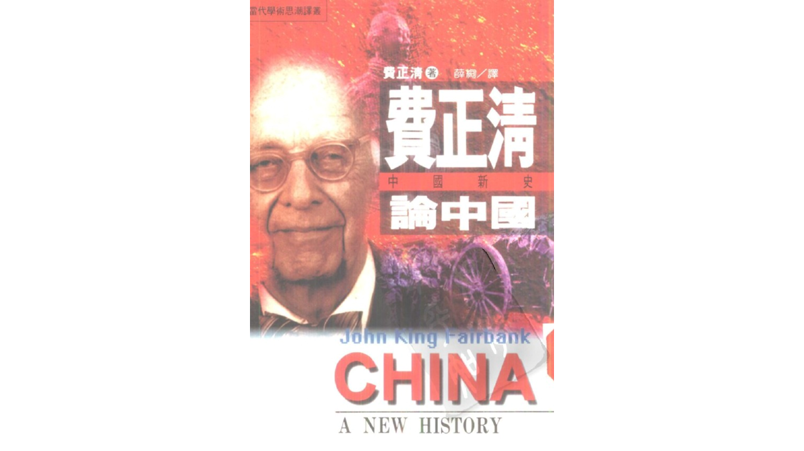
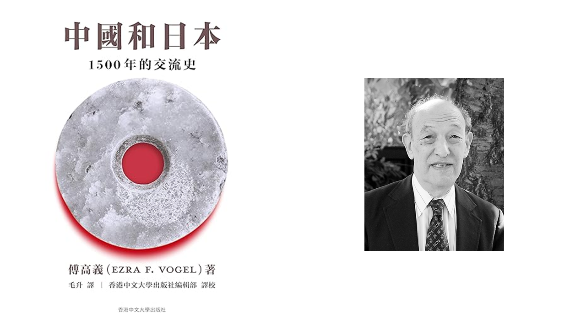
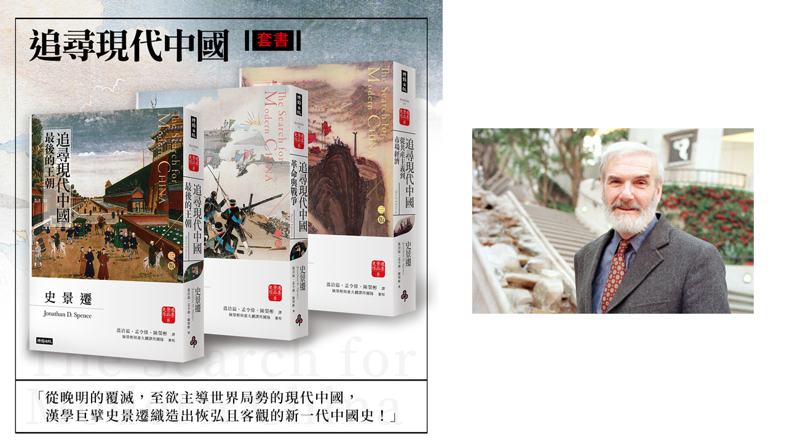
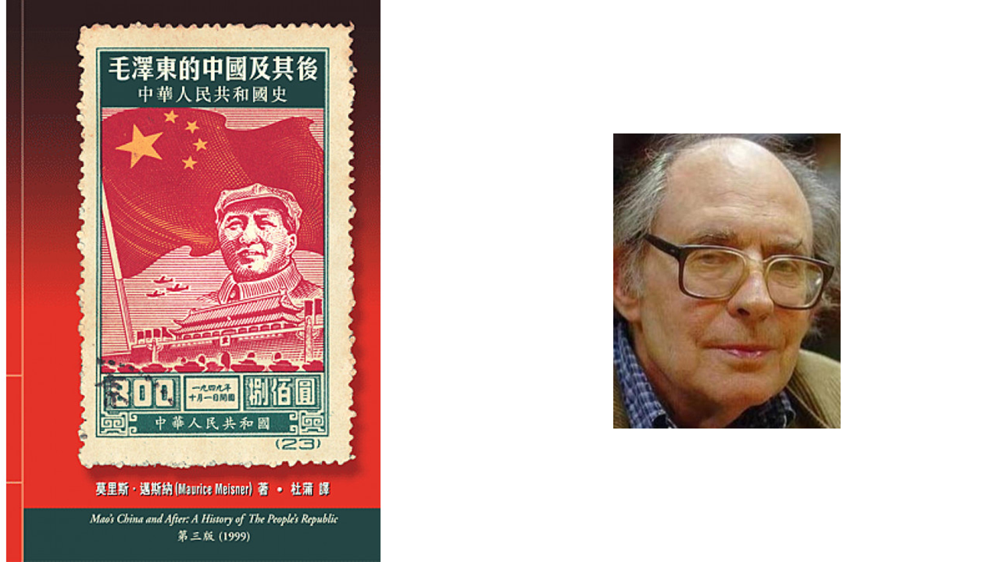
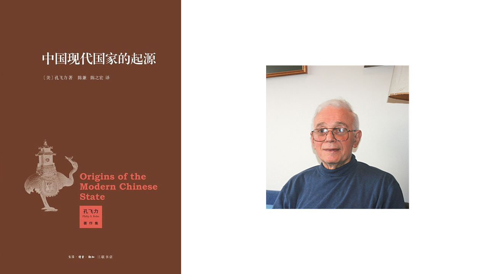
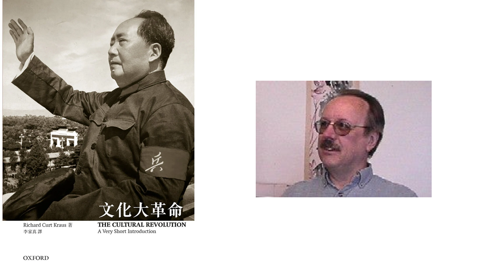

外国人有关中国的著述颇丰，可以说是一种「镜像」。现选几本简要介绍如下：

## 费正清《中国新史》

约翰·金·费尔班克（英语：John King Fairbank，1907年5月24日—1991年9月14日），汉名费正清，是美国汉学家、历史学家，哈佛大学教授，哈佛大学东亚研究中心的创始人。

《费正清论中国：中国新史》是费正清生平最后的一部著作。1991年9月12日上午他亲自将这部书的原稿送到哈佛大学出版社，下午他的心脏病复作，两天后便逝世了。

「六四」对于整个西方，特别是美国，是一幕惊心动魄的悲剧，几乎在一夜之间动摇了他们对于中国大陆的认识，美国人一向信任专家，他们对中共政权的理解是通过中国研究者的解释而得来的。一般而言，美国的中国研究者解释中共的兴起与发展都或多或少带上一层理想主义与浪漫主义的色彩。天安门前的枪声彻底惊破了这种理想和浪漫，一般美国人感到十分困惑，因此而有重新认识中国历史和文化的要求。天安门前的枪声如何惊破美国对中共的浪漫幻想？费正清如何看中国的历史制度？如何看中国的内战？如何看中华民族？如何论中共？他笔下的中共大跃进、文化大革命、接班斗争、邓小平的改革又如何？本书反映了中国史专题研究在美国的新方向和新收获。

## 傅高义《中国和日本：1500年的交流史》

傅高义（英语：Ezra Feivel Vogel，1930年7月11日—2020年12月20日），美国哈佛大学社会科学院荣休教授，精通日文，能说汉语，著有多部关于中国、日本和亚洲研究的著作。

中日一衣带水，两国文化和政治上的密切连结可追溯至1500年前，但如今则关系紧张。日本对中国不断增强的军事实力深感焦虑，而二战时的日军暴行给中国留下的创伤至今未愈。近年两国国民中对对方国家抱有好感的比例尚不及10%，她们都认为对方应以更开放的态度正视历史，否则关系难以改善。傅高义新作《中国和日本》，以公元600年日本吸取中国文明的核心元素开篇，述至二十世纪末中国向日本借鉴发展市场经济的经验，考察了中日关系史上的多个重要转捩点，包括朝贡贸易、甲午战争、殖民满洲、中日战争、改革开放前日本的对华援助、近年来中日关系的恶化等等。纵观中日交往的历史，两国间的文化联系源远流长，中国凭借广博的文明和丰富的资源占据上风。但到十九世纪，日本成功实现近代化改革，并于1895年在甲午战争中击败中国，从而扭转局势，后来居上。近四十年来，虽然推动贸易往来和观光交流的努力不断，二战创伤之巨仍使两国合作困难重重。傅高义强调日本应为战争中的侵略行为郑重道歉，同时也力劝中国将日本视为亚洲地区潜在的重要合作伙伴。为了世界秩序的稳定，中日必须从环境保护、灾难管理、全球经济及科学研究等领域的共同利益出发，重塑这两个大国间的关系。

## 史景迁《追寻现代中国》（三卷本）

乔纳森·德莫特·斯彭斯（英语：Jonathan Dermot Spence，1936年8月11日—2021年12月25日），汉名史景迁（意为景仰史学家司马迁），生于英国萨里郡，英裔美国籍的中国历史学家、汉学家，1993年起担任耶鲁大学历史学斯特林教席。他因深入研究中国历史而享誉国际，其研究涵盖了从明朝末期到现代的中国历史，特别注重个人与历史大背景之间的联系。

史景迁为让西方学子更系统地认识复杂的中国近代史，写就《追寻现代中国》。生动的描述、优美的文笔，不仅成功地成为西方了解中国史的入门书，历久不衰，在华人世界里也成为认识当代中国的经典名著。

上册从王朝倾灭至清朝帝制的终结，看明朝田赋制度如何影响清朝的民生；而主流学说的演变，从宋明理学、考证学到「中学为体，西学为用」，皆能左右朝廷遴选人才，甚而导致国家兴亡。在历经边患、民乱后，国际列强强势登陆，局势更为险峻复杂，内忧外患不断，终究迎来了清帝国的崩解以及共和国的建立。个人野心与国家利益、地方与中央的权力制衡，自晚明就不断以各种形式困扰中国，直至今日，仍无法获得解决。

中册以清帝国的衰亡为起点，一路走过纷乱的民国，直至国民党与共产党的内战。在史景迁的笔下，中国知识分子终于从天朝梦中惊醒，开始思索起自己与西方世界如何接轨，师法西方理论，重整大一统的理想版图。自袁世凯到蒋介石与毛泽东，政权的递嬗与斗争不曾停息；国民党与共产党，在资本主义及社会主义的路线中挣扎；然而国际列强也正虎视眈眈，欲左右政权发展以夺取更大的利益。此时的中国，彷彿一只死去的庞然巨兽，只剩尸体仍颤动着。底层人民的觉醒及抵抗，正反映了执政政体在经济、阶级上的衰弱和腐败。面对国家的种种沉痾、政权转移的死伤与纷乱、思想的无所依归，谁将汇聚起土地与人民的愤怒？中国又将走向何方？

下册从一九四九年国共分裂及朝鲜战争为起始，以新儒学在中国政界的复兴收尾，展现了七十年来中国政治、经济、外交的递嬗。史景迁在本册开宗明义写道，晚明至今，中国权力阶层总是缺乏和平转移过程，曾发生于晚明士子、清末维新，以及民初文人的境遇，在一九四九年后的中国依旧永无止尽地轮番上演。当毛泽东、周恩来、华国锋、邓小平、胡耀邦、赵紫阳彼此为了权力机锋相对，台面下是一代又一代的文人与百姓在禁锢的保守氛围中，欲意从极权缝隙里争取民主而流血牺牲。皇城前的天安门，见证了几代人的革命精神与百年来无法断绝的明争暗斗，以及人们对于国家繁荣的渴望。

## 莫里斯·迈斯纳《毛泽东的中国及其后：中华人民共和国史》

莫里斯·迈斯纳（英语：Maurice Jerome Meisner；1931年11月17日—2012年1月23日），汉名马思乐，研究二十世纪中国历史的美国学者，历任威斯康辛大学麦迪逊分校教授、伦敦政治经济学院客座教授。

本书根据莫里斯·迈斯纳（Maurice Meisner）的巨著Mao’s China and After: A History of People’s Republic of China第三版（1999）翻译而成，为首部繁体中文译本。有人认为1949年以后的中国是「毛泽东的中国」，这种说法虽不脱浓厚的个人崇拜色彩，却反映了一种历史的真实。因为毛泽东领导中国共产党，将马克思的理论同中国革命的实际相结合，经过艰难曲折的漫长道路，取得革命胜利，成立中华人民共和国。当代中国的进退得失，荣辱悲喜，都与毛泽东息息相关。研究他的意识形态和执政方针，认识当时中国的社会和政治实况，自有非常重要的现实意义。迈氏该部著作正为毛泽东时期的中国历史一锤定音。1999年再版时，迈氏新增「第六部：邓小平与中国资本主义的起源 1976–1998」，深刻地分析中国的民主、社会主义和资本主义三者之间的关系，并透彻地展示出中国在这些问题上言论和行动之间的反差。毛泽东掌政中国的时期，在当代史上是翻天覆地、引人入胜的一章，迈氏对此鞭辟入里，引人省思。近年中国在经济及政治上头角峥嵘，成为最有影响力的国家之一，迈氏就此亦有发人深省的论析。

## 孔飞力《中国现代国家的起源》

孔飞力，原名菲利普·阿尔登·孔恩（英语：Philip Alden Kuhn，1933年9月9日—2016年2月11日），中文名孔复礼（来自《论语》「克己复礼」），又名孔飞力。美国汉学专家，生于英格兰伦敦，是哈佛大学希根森（Francis Lee Higginson）历史讲座教授、东亚文明与语言系主任。

中国现代国家的形成在何种意义上是一种「中国的」过程？本书认为，早在鸦片战争之前，中国内部就面临着诸多根本性问题上的深刻危机。而如今这个「现代国家」，是两个世纪以来对于这些内部挑战不断回应的结果。作者探讨的正是在其形成过程中，中国本土提供的知识资源，即「现代性」的中国经验。

在本书中，作者分别从政治参与、政治竞争与政治控制三个角度入手，探索「现代国家」在中国形成和发展的「根本性议程」：在政治参与的拓展与国家权力之间的关系问题上，作者重新审视魏源基于经书典章的传统所提出的思考；在探讨公共利益是否能同政治竞争相协调的问题上，回顾晚清改革家冯桂芬的非正统建议在当时官僚中所引起的反应；面对调和国家财政需求同地方社会需要的问题，对比了清政府与共产党政府通过政治控制所做的不同努力和试验。作者认为，中国「现代性」的构建，包括这个现代国家的实现若成为可能，所根据的将不是西方的路径，而是中国自己的条件与经验。而中国的「现代国家」经验，不仅与中国有关，也具有普世意义。

## 理查德·柯特·克劳斯《牛津通识读本：文化大革命》

一九六六至一九七六年间，毛泽东发动的无产阶级文化大革命动摇了中国和世界的政治格局。这场运动主宰了当时中国人生活的方方面面：家庭四分五裂，前途地覆天翻，教育被迫中断，万众瞩目的政治试验连番上演，舞台布景一片混乱，新篇纷纷谱写，老账屡屡清算。这场运动至今仍是各种争议的导火线，因为它主张激进，规模浩大，影响到了将近十亿人的生活。

文化大革命虽然暴力充斥，却也是灵感和社会实验的一个源泉。文革为何使得民众亢奋，又为何使得如此众多的人归于幻灭？关于文革，我们自以为掌握的许多知识，如今却都已被事实推翻。在今天的中国，文革远没有淡出人们的记忆。本书试图用最浅白最精简的文字，讲述错综复杂的文革故事。书末并附有简明的文革时间表和主要人物简介。

